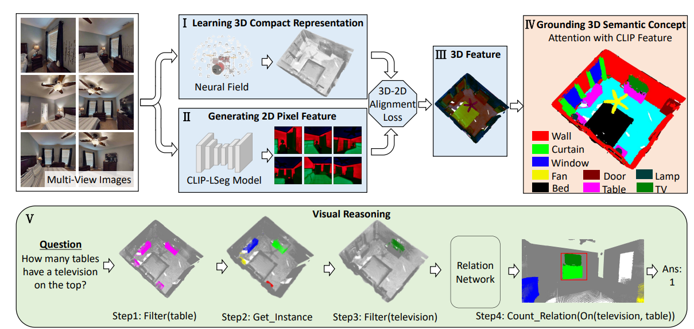

> # [CVPR 2023] 3D Concept Learning and Reasoning From Multi-View Images <br>
> [Paper](https://arxiv.org/abs/2303.11327)



## TODO 
* Depth and checkpoints take up a lot of space. Please email yninghong@gmail.com if you need them.

## Installation

The whole pipeline contains three steps to obtain the 3D feature of a room. The first 
step is using [LSeg](https://arxiv.org/abs/2201.03546) to obtain features for multi-view 2D images.
The second and third steps are using a NeRF-based model [DVGO](https://arxiv.org/abs/2111.11215) to map the 2D features to 3D.

We recommend using different virtual environment for the first step and the second & third steps. 

For the first step:

```
conda create -n lseg python=3.8
conda activate lseg
cd LSeg
pip install -r requirements.txt
```
Or follow the guidance in the official repository of LSeg in https://github.com/isl-org/lang-seg.


Similarly, for the second & third steps (these two steps share the same virtual environment):

```
conda create -n dvgo python=3.8
conda activate dvgo
cd DVGO
pip install -r requirements.txt
```
Or follow the guidance in the official repository of DVGO in https://github.com/sunset1995/DirectVoxGO.

## Data Generation Pipeline

The code related to dataset processing is under the data\_engine directory.

We use Habitat to render the dataset. Please refer to [habitat-lab](https://github.com/facebookresearch/habitat-lab) for building the rendering environment. Place the 3D scans of the hm3d dataset under the "train" / "val" directories respectively, then run:
```
python render_hm3d.py
```
Afterwards, the multi-view RGB images along with depth and pose information will be rendered. 


We could then use run the following script to mask out the regions that do not fall inside the room bounding box:
```
python mask_outside_room.py --room_name 00234-nACV8wLu1u5_10
```


## Dataset
The dataset can be found in this [Google Drive Link](https://drive.google.com/drive/folders/1sFUHGjsBYwtyqy8K2zsHBeFZIx4NluQN?usp=sharing). We are constantly updating this folder. Please email yninghong@gmail.com for more information.
The final dataset structure is like:
```
  -data   # multi-view images of single-room scenes
    - 00009-vLpv2VX547B_0    # most rooms contain 1000 views while some contain less. 00009-vLpv2VX547B means house 00009-vLpv2VX547B which is the same as HM3D dataset. _0 means it's the first room of the house
       - 0.png
       - 0_depth.npy
       - 0.json
       - 1.png
       - 1_depth.npy
       - 1.json
       ...
    - 00009-vLpv2VX547B_1
       - 0.png
       - 0_depth.npy
       - 0.json
       - 1.png
       - 1_depth.npy
       - 1.json
       ...
    ... 
    - 00891-cvZr5TUy5C5_9
       - 0.png
       - 0_depth.npy
       - 0.json
       - 1.png
       - 1_depth.npy
       - 1.json
       ...
  data_2  #multi-view images of two-room scenes
    - 00009-vLpv2VX547B_0_1    # most rooms contain 1000 views while some contain less. 00009-vLpv2VX547B means house 00009-vLpv2VX547B which is the same as HM3D dataset. _0 means the first room of the house, _1 means the second rooms of the house. Meaning that this scene consists of two rooms of house 00009-vLpv2VX547B .
       - 0.png
       - 0_depth.npy
       - 0.json
       - 1.png
       - 1_depth.npy
       - 1.json
  data_3   #multi-view images of two-room scenes
    - 00009-vLpv2VX547B_0_1_2    # most rooms contain 1500 views while some contain less. 00009-vLpv2VX547B means house 00009-vLpv2VX547B which is the same as HM3D dataset. _0 means the first room of the house, _1 means the second room of the house, _3 means the third room of the house. Meaning that this scene consists of three rooms of house 00009-vLpv2VX547B .
       - 0.png
       - 0_depth.npy
       - 0.json
       - 1.png
       - 1_depth.npy
       - 1.json
  data_whole  #multi-view images of whole-house scenes
    - 00009-vLpv2VX547B
       - 0.png
       - 0_depth.npy
       - 0.json
       - 1.png
       - 1_depth.npy
       - 1.json
  questions_train.json #questions and answers of training dataset
  questions_val.json
  questions_test.json
  all_concepts.json #all concepts of the dataset
  objects_bboxes_per_room.zip  #object bounding boxes of each room
  room_bboxes_with_wallsrevised_axis.zip  #room bounding boxes of the houses
  single_room_concepts3_after_bboxes_after_replace.zip #Useful concepts of each room
```


## Training

### First Stage

Run the command (take room "00009-vLpv2VX547B_1" as an example):

```
conda activate lseg
cd LSeg
python run_lseg.py --room_name 00009-vLpv2VX547B_1 > logs/00009-vLpv2VX547B_1.log
```

Afterwards, the extracted 2D features for multi-view images will be stored in the directory "00009-vLpv2VX547B_1_result"
under the same "datadir" directory of all the data.

### Second Stage

Run the command (take room "00009-vLpv2VX547B_1" as an example):

```
conda activate dvgo
cd DVGO
python run.py --config configs/custom/00009-vLpv2VX547B_1.py
```

Afterwards, the checkpoints will be stored in the log directory defined in the configuration file "./DVGO/configs/custom/default_ubd_inward_facing.py".

### Third Stage

Run the command (take room "00009-vLpv2VX547B_1" as an example):

```
conda activate dvgo
cd DVGO_feature
python run.py --config configs/custom/00009-vLpv2VX547B_1.py
```

Afterwards, the checkpoints and the rendered 3D feature for this room will be stored in the directory defined in the configuration file "./DVGO_feature/configs/custom/default_ubd_inward_facing.py".
It is recommended that the log directory of the two configuration files in the second & third stages are the same. It will be easier to manage the experimental results.

### Post Processing

We have generated the neural field 3D features given the above. The following script is for the attention between 3D features and language 3D features and get the grounding results (ply).

```
cd post_process
python attention_ground.py
```

It will generate two files: ply is for visualization of segmentation (grounding) and npy score is to store the category id with the maximum score for each point.
Highly recommend delete the ceilings for visualization.

## Citation
If you find our work useful, please consider citing:
```BibTeX
@inproceedings{cvpr23_3dclr,
    author    = {Hong, Yining and Lin, Chunru and Du, Yilun and Chen, Zhenfang and Tenenbaum, Joshua B. and Gan, Chuang},
    title     = {3D Concept Learning and Reasoning From Multi-View Images},
    booktitle = {IEEE/CVF Conference on Computer Vision and Pattern Recognition (CVPR)},
    year      = {2023},
}
```

### Acknowledgement
The codes are largely borrowed from the LSeg and DVGO:

https://github.com/isl-org/lang-seg

https://github.com/sunset1995/DirectVoxGO

Thanks the authors for sharing the code implementation.
